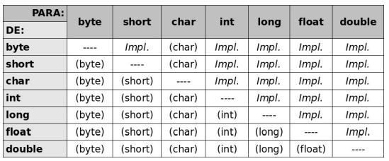

# O que eu aprendi:
- A condigurar o ambiente de senvolvimento, instalando a JDK 17 e a IDE Intellij;
- As diferenças entre JVM, JRE e JDK;
- - JVM(Java Virtual Machine) é a máquina Virtual do java responsável por executar o bytecode;
- - JRE(Java Runtime Environmente) Ambiente de Execução do Java que fornece as bibliotecas padrões do java para o 
    JDK compilar o código e para a JVM executar o programa;
- - JDK (Java Development Kit) - Kit de Desenvolvimento Java responsável por compilar código-fonte em bytecode.
- E fazer o "Alô Mundo!" no Java e executar o meu primeiro programa pelo Intellij;

# Para saber mais: convenção de código
- A convenção de código do Java é um conjunto de regras recomendadas para escrever código Java que é fácil de ler, 
entender e manter. Essas regras foram definidas pela Oracle, a empresa que mantém a linguagem Java, e são amplamente 
seguidas pela comunidade de desenvolvedores Java.

# Aqui estão algumas das principais convenções de código do Java:

- Nomes de classes devem começar com letra maiúscula e usar a convenção PascalCase (também conhecida como Upper 
CamelCase).
- - Exemplo: MinhaClasse.

- Nomes de métodos devem começar com letra minúscula e usar a convenção camelCase.
- - Exemplo: meuMetodo().

- Nomes de constantes devem ser totalmente em letras maiúsculas, separadas por underline.
- - Exemplo: MINHA_CONSTANTE.

- Nomes de variáveis devem começar com letra minúscula e usar a convenção camelCase.
- - Exemplo: minhaVariavel.

- Todas as linhas de código devem ter no máximo 80 caracteres de largura para facilitar a leitura.
- Recomenda-se usar espaços em branco para separar operadores, palavras-chave e elementos de controle de fluxo.
- - Exemplo: if (condicao) {.

- Use comentários para documentar seu código, explicando o que ele faz e por que ele faz isso. Comentários devem ser  
claros e concisos.
- Esse ponto anterior, referente aos comentários, é polêmico, pois muitas pessoas desenvolvedoras consideram que um 
bom  código deve ser autoexplicativo. Se você utiliza nomes intuitivos e descritivos para suas variáveis e métodos,  
ica mais claro de entender o que está acontecendo no código, dispensando a necessidade de uso de comentários.

- Essas são apenas algumas das convenções de código mais comuns no Java. Seguir essas regras pode tornar seu código 
mais  fácil de ler e entender, o que pode economizar tempo e esforço no longo prazo.

- É importante lembrar que as convenções de código são apenas recomendações, e não regras obrigatórias. No entanto, 
seguir essas convenções pode ajudar a criar um padrão consistente em todo o seu código Java e também torná-lo mais fácil 
de compartilhar e colaborar com outros desenvolvedores.

# Para saber mais: tipos primitivos
- Em Java, assim como na maioria das linguagens de programação, existem os tipos primitivos, que são os tipos de 
  dados mais básicos e fundamentais da linguagem. Eles são utilizados para representar valores simples e são 
  definidos pela própria linguagem.
- Java possui oito tipos primitivos diferentes: boolean, byte, char, short, int, long, float e double. Cada um 
  desses tipos possui suas próprias características e faixa de valores permitidos, conforme será descrito a seguir:

## boolean
- O tipo boolean é utilizado para representar valores lógicos, podendo assumir apenas dois valores: true ou false. 
  É utilizado em expressões condicionais, loops e outros casos onde se deseja avaliar se uma determinada condição é 
  verdadeira ou falsa.
## byte
- O tipo byte é utilizado para representar valores numéricos inteiros de 8 bits. Ele possui uma faixa de valores de 
  -128 a 127.
## char
- O tipo char é utilizado para representar caracteres individuais. Ele pode armazenar qualquer caractere Unicode e 
  é representado por aspas simples ('').
## short
- O tipo short é utilizado para representar valores numéricos inteiros de 16 bits. Ele possui uma faixa de valores 
  de -32.768 a 32.767.
## int
- O tipo int é utilizado para representar valores numéricos inteiros de 32 bits. É um dos tipos de dados mais 
  utilizados para representar números inteiros em Java e possui uma faixa de valores de -2.147.483.648 a 2.147.483.647.
## long
- O tipo long é utilizado para representar valores numéricos inteiros de 64 bits. Ele é utilizado para representar 
  valores inteiros muito grandes e possui uma faixa de valores de -9.223.372.036.854.775.808 a 9.223.372.036.854.
  775.807.
## float
- O tipo float é utilizado para representar valores numéricos de ponto flutuante, ou seja, valores com casas 
  decimais, sendo que ocupa 32 bits de memória. Ele pode representar números decimais com até sete dígitos e tem uma 
  precisão limitada, o que significa que ele pode arredondar os números se eles forem muito grandes ou muito pequenos.
## double
- O tipo double é similar o float, entretanto ele ocupa 64 bits de memória e pode representar números decimais com 
  até 15 dígitos.

# Para saber mais: comentários no código fonte

- Ao escrever código em Java, é importante que o seu código seja legível e compreensível para outras pessoas, além 
  de você mesmo no futuro. Uma das maneiras de fazer isso é por meio do uso de comentários de código, pois eles 
  ajudam a explicar o que o seu código está fazendo e por que ele foi escrito daquela maneira.
## Como funcionam os comentários em Java?
- O compilador Java ignora todos os trechos de comentários de código, então eles não afetam o funcionamento do seu 
  programa. Existem duas principais formas de se escrever comentários em Java:

- Comentários de linha única: São comentários que aparecem em uma única linha e começam com duas barras "//". O 
compilador Java ignora todo o texto que aparece após as duas barras até o final da linha.
- - Exemplo:
- // Esta é uma linha de comentário que será ignorada pelo compilador

- Comentários de várias linhas: Esses comentários podem abranger várias linhas e são delimitados por "/" e "/". O 
  compilador Java ignora todo o texto que aparece entre esses dois símbolos.
- - Exemplo:
- /* Este é um exemplo de comentário
  de várias linhas em Java
  que será ignorado pelo compilador */

## Comentários são importantes?
- Os comentários são importantes porque ajudam a tornar o código mais legível e compreensível para outras pessoas 
  que vão precisar ler e dar manutenção no código. Isso é especialmente importante quando várias pessoas trabalham 
  no mesmo projeto. Comentários claros e concisos ajudam a explicar o que o código está fazendo, por que ele foi 
  escrito daquela maneira e como ele funciona.

# Para saber mais: casting:
- Casting é um recurso utilizado em Java para converter um tipo de dado em outro. Essa conversão pode ser feita de 
forma automática pelo compilador (conversão implícita), quando o tipo de dado de destino é compatível com o tipo de 
dado de origem, ou de forma manual (conversão explícita), utilizando o operador de casting.

- O casting é utilizado para permitir que tipos de dados incompatíveis possam ser utilizados em uma mesma operação ou 
expressão. Por exemplo, se um método espera um parâmetro do tipo int e o valor que se deseja passar é do tipo double,
é necessário fazer um casting para converter o valor em int.

## Casting implícito
- O casting implícito é realizado automaticamente pelo compilador quando o tipo de dado de origem é compatível com o 
tipo de dado de destino. Por exemplo, é possível atribuir um valor de tipo int a uma variável do tipo double, pois o
tipo double é maior e suporta todos os valores que o tipo int pode armazenar:

- int x = 10;
- double y = x; // casting implícito

## Casting explícito
- O casting explícito é realizado quando o tipo de dado de origem é incompatível com o tipo de dado de destino. Nesse 
caso, devemos utilizar o operador de casting para realizar a conversão:

- double x = 10.5;
- int y = (int) x; // casting explícito

- No exemplo anterior, o valor da variável x é convertido em um valor inteiro utilizando o casting explícito. É 
importante notar que, neste caso, a parte decimal será descartada e o valor atribuído à variável y será 10.
- Abaixo tem uma tabela, onde você pode visualizar mais facilmente as conversões que são implícitas e as que 
necessitam ser feitas de forma explícita.
- 

# O que aprendemos construindo o catélodo de filmes:

- A trabalhar com variáveis: recurso utilizado para armazenar valores em memória
- Sobre tipos primitivos
- - inteiros(byte, short, int e long);
- - ponto flutuante(double e float);
- - char: contém um único caractere;
- - boolean recebe 2 valores: false e true;
- Como representar textos em Java, utilizando a classe String;
- A realizar **casting** de valores, para resolver situações de tipos incompatíveis no momento de realizar um 
  cálculo ou atribuição de uma variável.
